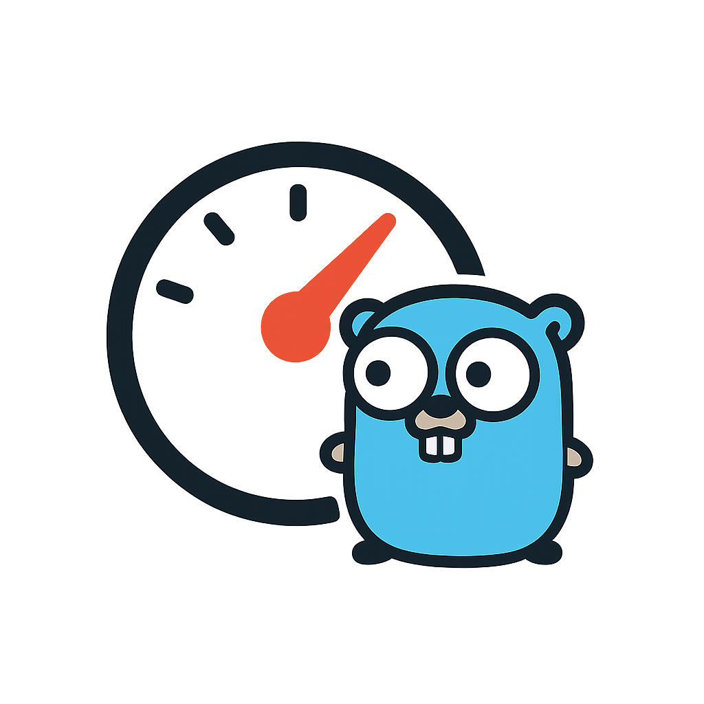

<p align="center">
  
</p>

# GoRL - High-Performance Rate Limiter Library

GoRL is a high-performance, extensible rate limiter library for Go. It supports multiple algorithms, pluggable storage backends, a metrics collector abstraction, and minimal dependencies, making it ideal for both single-instance and distributed systems.

---

## Table of Contents

* [Features](#features)
* [Installation](#installation)
* [Quick Start](#quick-start)
* [Usage Examples](#usage-examples)
* [Observability](#observability)
* [Benchmarks](#benchmarks)
* [Storage Backends](#storage-backends)
* [Extending GoRL](#extending-gorl)
* [Contributing](#contributing)
* [License](#license)

## Features

* **Algorithms**: Fixed Window, Sliding Window, Token Bucket, Leaky Bucket
* **Storage**: In-memory, Redis, or any custom store (via `Storage` interface)
* **Fail-Open / Fail-Close**: Configurable policy on backend errors
* **Key Extraction**: Built-in strategies (IP, API key) or custom
* **Metrics Collector**: Optional abstraction for counters and histograms, zero-cost when unused
* **Minimal Dependencies**: Zero external requirements for in-memory mode
* **Middleware Support**: Ready-made integration examples (e.g., Fiber)

## Installation

```bash
go get github.com/AliRizaAynaci/gorl
```

## Quick Start

```go
import (
  "fmt"
  "time"

  "github.com/AliRizaAynaci/gorl"
  "github.com/AliRizaAynaci/gorl/core"
)

func main() {
  limiter, err := gorl.New(core.Config{
    Strategy: core.SlidingWindow,
    KeyBy:    core.KeyByAPIKey,
    Limit:    5,
    Window:   1 * time.Minute,
    RedisURL: "redis://localhost:6379/0",
  })
  if err != nil {
    panic(err)
  }

  for i := 1; i <= 10; i++ {
    allowed, _ := limiter.Allow("user-123")
    fmt.Printf("Request #%d: allowed=%v\n", i, allowed)
  }
}
```

## Usage Examples

### Fiber Middleware (In-Memory Sliding Window)

```go
import (
  "github.com/gofiber/fiber/v2"
)

app := fiber.New()
app.Use(func(c *fiber.Ctx) error {
  allowed, err := limiter.Allow(c.IP())
  if err != nil || !allowed {
    return c.Status(fiber.StatusTooManyRequests).
      SendString("Rate limit exceeded")
  }
  return c.Next()
})

app.Listen(":3000")
```

### Docker & Redis Backend

```bash
docker run --name redis-limiter -p 6379:6379 -d redis
```

```go
limiter, err := gorl.New(core.Config{
  Strategy: core.TokenBucket,
  KeyBy:    core.KeyByIP,
  Limit:    100,
  Window:   1 * time.Minute,
  RedisURL: "redis://localhost:6379/0",
})
if err != nil {
  panic(err)
}
```

## Observability

GoRL provides an optional metrics collector abstraction. Below is an example integrating Prometheus:

```go
import (
  "log"
  "net/http"
  "time"

  "github.com/AliRizaAynaci/gorl"
  "github.com/AliRizaAynaci/gorl/core"
  "github.com/AliRizaAynaci/gorl/metrics"
  "github.com/prometheus/client_golang/prometheus/promhttp"
)

func main() {
  // Create and register Prometheus collector
  pm := metrics.NewPrometheusCollector("gorl", "sliding_window")
  metrics.RegisterPrometheusCollectors(pm)

  // Initialize limiter with metrics enabled
  limiter, err := gorl.New(core.Config{
    Strategy: core.SlidingWindow,
    KeyBy:    core.KeyByAPIKey,
    Limit:    5,
    Window:   1 * time.Minute,
    RedisURL: "redis://localhost:6379/0",
    Metrics:  pm,
  })
  if err != nil {
    log.Fatal(err)
  }

  // Expose Prometheus metrics endpoint
  http.Handle("/metrics", promhttp.Handler())

  // Application handler with rate limiting
  http.HandleFunc("/api", func(w http.ResponseWriter, r *http.Request) {
    allowed, _ := limiter.Allow(r.Header.Get("X-API-Key"))
    if !allowed {
      http.Error(w, "rate limit exceeded", http.StatusTooManyRequests)
      return
    }
    w.Write([]byte("OK"))
  })

  log.Println("Listening on :8080")
  log.Fatal(http.ListenAndServe(":8080", nil))
}
```

## Benchmarks

Benchmarks run on AMD Ryzen 7 4800H.

| Algorithm      | Single Key (ns/op, B/op, allocs) | Multi Key (ns/op, B/op, allocs) |
| -------------- | -------------------------------- | ------------------------------- |
| Fixed Window   | 89.2 ns/op, 24 B/op, 1 alloc     | 202.5 ns/op, 30 B/op, 2 allocs  |
| Leaky Bucket   | 333.8 ns/op, 112 B/op, 4 allocs  | 506.4 ns/op, 126 B/op, 5 allocs |
| Sliding Window | 260.5 ns/op, 72 B/op, 3 allocs   | 444.0 ns/op, 86 B/op, 4 allocs  |
| Token Bucket   | 339.6 ns/op, 128 B/op, 4 allocs  | 504.4 ns/op, 126 B/op, 5 allocs |

## Storage Backends

GoRL's storage layer uses a minimal key-value interface.

```go
// Storage defines a minimal interface for rate limiter backends.
// Implementations only need to support Get, Set, and Incr with TTL.
package storage

import "time"

type Storage interface {
  // Incr atomically increments the value at key by 1, initializing to 1 if missing or expired.
  Incr(key string, ttl time.Duration) (float64, error)

  // Get retrieves the numeric value at key, returning 0 if missing or expired.
  Get(key string) (float64, error)

  // Set stores the numeric value at key with the specified TTL.
  Set(key string, val float64, ttl time.Duration) error
}
```

### In-Memory Store

Thread-safe implementation using Go's `sync.Mutex`:

```go
store := inmem.NewInMemoryStore()
```

* **Use case**: single-instance and unit tests
* **Expiration**: TTL on each write, lazy cleanup
* **Concurrency**: protected by mutex

### Redis Store

Scalable store leveraging Redis commands:

```go
store := redis.NewRedisStore("redis://localhost:6379/0")
```

* **Counter**: `INCR` + `EXPIRE`
* **TTL Management**: reset expire on each write
* **Use case**: distributed services

## Extending GoRL

To add a custom backend, implement the `Storage` interface:

```go
type MyStore struct { /* ... */ }

func (m *MyStore) Incr(key string, ttl time.Duration) (float64, error) { /* ... */ }
func (m *MyStore) Get(key string) (float64, error)       { /* ... */ }
func (m *MyStore) Set(key string, val float64, ttl time.Duration) error { /* ... */ }
```

Then pass your store directly to any algorithm constructor:

```go
import (
  "github.com/AliRizaAynaci/gorl/core"
  "github.com/AliRizaAynaci/gorl/internal/algorithms"
)

myStore := &MyStore{/* init */}
limiter := algorithms.NewSlidingWindowLimiter(core.Config{
  Limit:  100,
  Window: 1 * time.Minute,
}, myStore)
```

## Contributing

1. Fork the repository
2. Create a branch: `git checkout -b feature/YourFeature`
3. Commit changes: `git commit -m "Add feature"`
4. Push to branch: `git push origin feature/YourFeature`
5. Submit a Pull Request

Please review our [CONTRIBUTING.md](CONTRIBUTING.md) for detailed guidelines.

## License

Distributed under the MIT License. See [LICENSE](LICENSE) for details.
