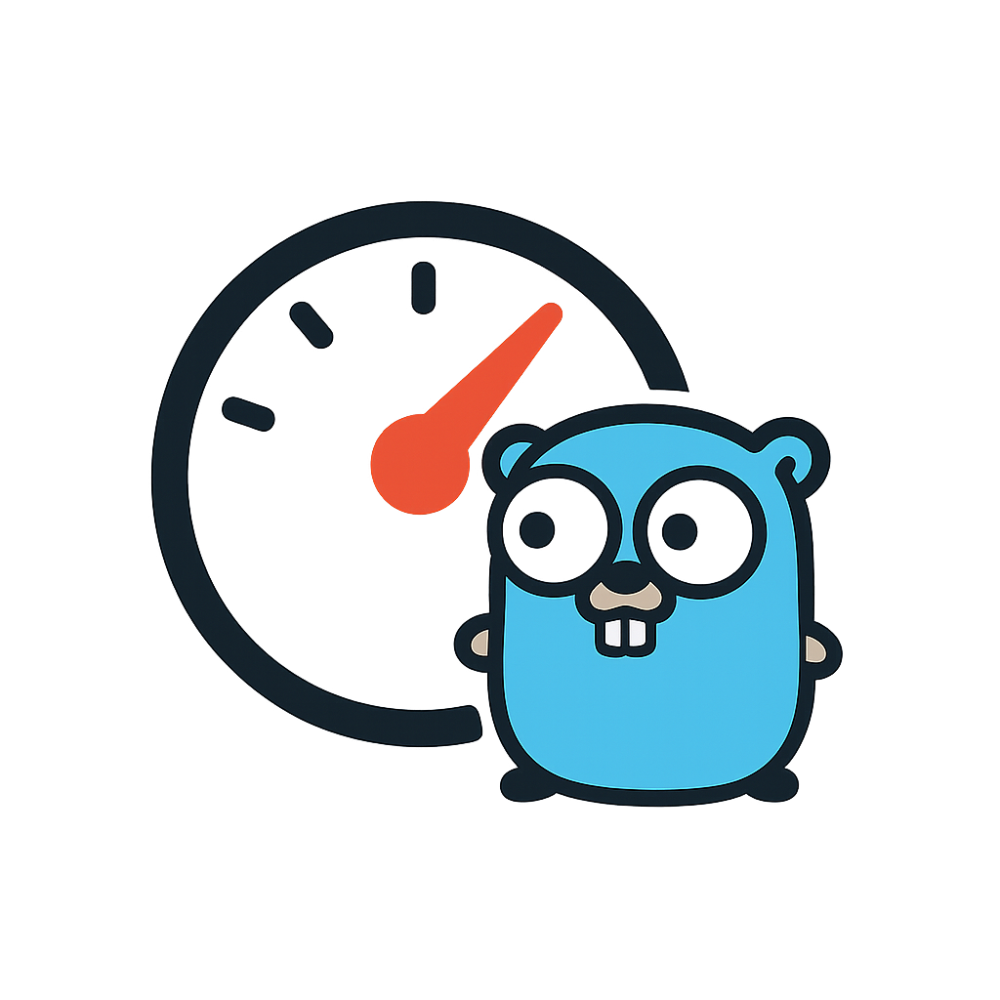

<p align="center">
  
</p>

# GoRL - High-Performance Rate Limiter Library

GoRL is a high-performance, extensible rate limiter library for Go. It supports multiple algorithms, pluggable storage backends, a metrics collector abstraction, and minimal dependencies, making it ideal for both single-instance and distributed systems.

---

## Table of Contents

* [Features](#features)
* [Installation](#installation)
* [Quick Start](#quick-start)
* [Usage Examples](#usage-examples)
* [Observability](#observability)
* [Benchmarks](#benchmarks)
* [Storage Backends](#storage-backends)
* [Extending GoRL](#extending-gorl)
* [Contributing](#contributing)
* [License](#license)

## Features

* **Algorithms**: Fixed Window, Sliding Window, Token Bucket, Leaky Bucket
* **Storage**: In-memory, Redis, or any custom store (via `Storage` interface)
* **Fail-Open / Fail-Close**: Configurable policy on backend errors
* **Key Extraction**: Built-in strategies (IP, API key) or custom
* **Metrics Collector**: Optional abstraction for counters and histograms, zero-cost when unused
* **Minimal Dependencies**: Zero external requirements for in-memory mode
* **Middleware Support**: Built-in middleware for `net/http`, Fiber, Gin, and Echo

## Installation

```bash
go get github.com/AliRizaAynaci/gorl/v2
```

## Quick Start

```go
import (
  "context"
  "fmt"
  "time"

  "github.com/AliRizaAynaci/gorl/v2"
  "github.com/AliRizaAynaci/gorl/v2/core"
)

func main() {
  limiter, err := gorl.New(core.Config{
    Strategy: core.SlidingWindow,
    Limit:    5,
    Window:   1 * time.Minute,
  })
  if err != nil {
    panic(err)
  }
  defer limiter.Close()

  ctx := context.Background()
  for i := 1; i <= 10; i++ {
    res, _ := limiter.Allow(ctx, "user-123")
    fmt.Printf("Request #%d: allowed=%v, remaining=%d\n", i, res.Allowed, res.Remaining)
  }
}
```

## Usage Examples

### HTTP Middleware (Built-in)

GoRL ships with a ready-to-use `net/http` middleware under `middleware/http`.

**Basic Usage (handler wrapping):**

```go
import (
  "net/http"

  "github.com/AliRizaAynaci/gorl/v2"
  "github.com/AliRizaAynaci/gorl/v2/core"
  mw "github.com/AliRizaAynaci/gorl/v2/middleware/http"
)

limiter, _ := gorl.New(core.Config{
  Strategy: core.SlidingWindow,
  Limit:    10,
  Window:   1 * time.Minute,
})

mux := http.NewServeMux()
mux.Handle("/api/", mw.RateLimit(limiter, mw.Options{
  KeyFunc: mw.KeyByIP(),
}, http.HandlerFunc(func(w http.ResponseWriter, r *http.Request) {
  w.Write([]byte("OK"))
})))

http.ListenAndServe(":8080", mux)
```

**Middleware Chaining:**

```go
rl := mw.NewMiddleware(limiter, mw.Options{
  KeyFunc: mw.KeyByHeader("X-API-Key"),
})

mux.Handle("/api/", rl(myHandler))
```

The middleware automatically sets standard rate-limit headers on every response:
`RateLimit-Limit`, `RateLimit-Remaining`, `RateLimit-Reset`, and `Retry-After`.

**Available Key Extractors:**
- `mw.KeyByIP()` — client IP (supports `X-Forwarded-For`, `X-Real-Ip`)
- `mw.KeyByHeader("X-API-Key")` — any request header
- `mw.KeyByPath()` — IP + request path (per-endpoint limiting)

### Fiber

```go
import (
  "github.com/gofiber/fiber/v2"
  "github.com/AliRizaAynaci/gorl/v2"
  "github.com/AliRizaAynaci/gorl/v2/core"
  fibermw "github.com/AliRizaAynaci/gorl/v2/middleware/fiber"
)

limiter, _ := gorl.New(core.Config{
  Strategy: core.FixedWindow, Limit: 100, Window: time.Minute,
})

app := fiber.New()
app.Use(fibermw.RateLimit(limiter)) // key defaults to c.IP()
app.Listen(":3000")
```

### Gin

```go
import (
  "github.com/gin-gonic/gin"
  "github.com/AliRizaAynaci/gorl/v2"
  "github.com/AliRizaAynaci/gorl/v2/core"
  ginmw "github.com/AliRizaAynaci/gorl/v2/middleware/gin"
)

limiter, _ := gorl.New(core.Config{
  Strategy: core.SlidingWindow, Limit: 100, Window: time.Minute,
})

r := gin.Default()
r.Use(ginmw.RateLimit(limiter)) // key defaults to c.ClientIP()
r.Run(":8080")
```

### Echo

```go
import (
  "github.com/labstack/echo/v4"
  "github.com/AliRizaAynaci/gorl/v2"
  "github.com/AliRizaAynaci/gorl/v2/core"
  echomw "github.com/AliRizaAynaci/gorl/v2/middleware/echo"
)

limiter, _ := gorl.New(core.Config{
  Strategy: core.TokenBucket, Limit: 100, Window: time.Minute,
})

e := echo.New()
e.Use(echomw.RateLimit(limiter)) // key defaults to c.RealIP()
e.Start(":8080")
```

> All framework middlewares automatically set `RateLimit-*` and `Retry-After` headers.
> Pass a custom `Config{KeyFunc: ...}` to override the default key extraction.

### Docker & Redis Backend

```bash
docker run --name redis-limiter -p 6379:6379 -d redis
```

```go
limiter, err := gorl.New(core.Config{
  Strategy: core.TokenBucket,
  KeyBy:    core.KeyByIP,
  Limit:    100,
  Window:   1 * time.Minute,
  RedisURL: "redis://localhost:6379/0",
})
if err != nil {
  panic(err)
}
```

## Observability

GoRL provides an optional metrics collector abstraction. Below is an example integrating Prometheus:

```go
import (
  "log"
  "net/http"
  "time"

  "github.com/AliRizaAynaci/gorl/v2"
  "github.com/AliRizaAynaci/gorl/v2/core"
  "github.com/AliRizaAynaci/gorl/v2/metrics"
  mw "github.com/AliRizaAynaci/gorl/v2/middleware/http"
  "github.com/prometheus/client_golang/prometheus/promhttp"
)

func main() {
  // Create and register Prometheus collector
  pm := metrics.NewPrometheusCollector("gorl", "sliding_window")
  metrics.RegisterPrometheusCollectors(pm)

  // Initialize limiter with metrics enabled
  limiter, err := gorl.New(core.Config{
    Strategy: core.SlidingWindow,
    Limit:    5,
    Window:   1 * time.Minute,
    RedisURL: "redis://localhost:6379/0",
    Metrics:  pm,
  })
  if err != nil {
    log.Fatal(err)
  }
  defer limiter.Close()

  // Expose Prometheus metrics endpoint
  http.Handle("/metrics", promhttp.Handler())

  // Application handler with rate limiting middleware
  http.Handle("/api", mw.RateLimitFunc(limiter, mw.Options{
    KeyFunc: mw.KeyByHeader("X-API-Key"),
  }, func(w http.ResponseWriter, r *http.Request) {
    w.Write([]byte("OK"))
  }))

  log.Println("Listening on :8080")
  log.Fatal(http.ListenAndServe(":8080", nil))
}
```

## Benchmarks

Benchmarks run on AMD Ryzen 7 4800H.

| Algorithm      | Single Key (ns/op, B/op, allocs)     | Multi Key (ns/op, B/op, allocs)      |
| -------------- | ------------------------------------ | ------------------------------------ |
| Fixed Window   | 103.8 ns/op, 16 B/op, 1 allocs/op    | 232.5 ns/op, 30 B/op, 2 allocs/op    |
| Sliding Window | 372.3 ns/op, 64 B/op, 3 allocs/op    | 625.4 ns/op, 86 B/op, 4 allocs/op    |
| Token Bucket   | 634.4 ns/op, 208 B/op, 8 allocs/op   | 955.8 ns/op, 222 B/op, 9 allocs/op   |
| Leaky Bucket   | 515.2 ns/op, 208 B/op, 8 allocs/op   | 916.0 ns/op, 222 B/op, 9 allocs/op   |

## Storage Backends

GoRL's storage layer uses a minimal key-value interface.

```go
package storage

import (
  "context"
  "time"
)

type Storage interface {
  // Incr atomically increments the value at key by 1, initializing to 1 if missing or expired.
  Incr(ctx context.Context, key string, ttl time.Duration) (float64, error)

  // Get retrieves the numeric value at key, returning 0 if missing or expired.
  Get(ctx context.Context, key string) (float64, error)

  // Set stores the numeric value at key with the specified TTL.
  Set(ctx context.Context, key string, val float64, ttl time.Duration) error

  // Close releases any resources held by the storage backend.
  Close() error
}
```

### In-Memory Store

Lock-free implementation using `sync.Map` and `sync/atomic`:

```go
store := inmem.NewInMemoryStore()
```

* **Use case**: single-instance and unit tests
* **Expiration**: TTL on each write, background GC cleanup
* **Concurrency**: lock-free via atomic CAS operations

### Redis Store

Scalable store leveraging Redis commands:

```go
store := redis.NewRedisStore("redis://localhost:6379/0")
```

* **Counter**: `INCR` + `EXPIRE`
* **TTL Management**: reset expire on each write
* **Use case**: distributed services

## Custom Storage Backend

By default, `gorl.New(cfg core.Config)` wires up:

* **Redis** (if `cfg.RedisURL` is set)
* **In-memory** (otherwise)

To add any other storage backend (JetStream, DynamoDB, etc.) without forking the repo, follow these steps:

1. **Create** a sub-package `github.com/AliRizaAynaci/gorl/v2/storage/yourmodule` and implement the `storage.Storage` interface:

   ```go
   // github.com/AliRizaAynaci/gorl/v2/storage/yourmodule/store.go
   package yourmodule

   import (
     "context"
     "time"
     "github.com/AliRizaAynaci/gorl/v2/storage"
   )

   // YourModuleStore holds your connection fields.
   type YourModuleStore struct {
     // e.g. client, context
   }

   // NewYourModuleStore constructs your store with any parameters.
   func NewYourModuleStore(/* params */) *YourModuleStore {
     return &YourModuleStore{/* initialize fields */}
   }

   func (s *YourModuleStore) Incr(ctx context.Context, key string, ttl time.Duration) (float64, error) {
     // increment logic
   }
   func (s *YourModuleStore) Get(ctx context.Context, key string) (float64, error) {
     // get logic
   }
   func (s *YourModuleStore) Set(ctx context.Context, key string, val float64, ttl time.Duration) error {
     // set logic
   }
   func (s *YourModuleStore) Close() error {
     // cleanup logic
   }
   ```

2. **Extend** `core.Config` in `gorl/core/config.go`:

   ```go
   type Config struct {
     Strategy      StrategyType
     Limit         float64
     Window        time.Duration
     RedisURL      string
     YourModuleURL string // ← new field
     Metrics       Metrics
   }
   ```

3. **Wire** your store in `gorl/limiter.go`:

   ```go
   func New(cfg core.Config) (core.Limiter, error) {
     if cfg.Metrics == nil {
       cfg.Metrics = &core.NoopMetrics{}
     }

     var store storage.Storage
     switch {
     case cfg.YourModuleURL != "":
       store = yourmodule.NewYourModuleStore(cfg.YourModuleURL)
     case cfg.RedisURL != "":
       store = redis.NewRedisStore(cfg.RedisURL)
     default:
       store = inmem.NewInMemoryStore()
     }

     constructor, ok := strategyRegistry[cfg.Strategy]
     if !ok {
       return nil, core.ErrUnknownStrategy
     }
     return constructor(cfg, store), nil
   }
   ```

4. **Use** your custom backend:

   ```go
   import (
     "log"
     "time"
     "github.com/AliRizaAynaci/gorl/v2"
     "github.com/AliRizaAynaci/gorl/v2/core"
   )

   cfg := core.Config{
     Strategy:      core.SlidingWindow,
     Limit:         100,
     Window:        time.Minute,
     YourModuleURL: "your-backend://connection-string",
   }
   limiter, err := gorl.New(cfg)
   if err != nil {
     log.Fatal(err)
   }
   ```

> **Note:** After implementing and wiring up your custom storage backend, open a Pull Request against the `main` branch to merge these changes into the GoRL repository before using it in production.


## Contributing

1. Fork the repository
2. Create a branch: `git checkout -b feature/YourFeature`
3. Commit changes: `git commit -m "Add feature"`
4. Push to branch: `git push origin feature/YourFeature`
5. Submit a Pull Request

Please review our [CONTRIBUTING.md](CONTRIBUTING.md) for detailed guidelines.

## License

Distributed under the MIT License. See [LICENSE](LICENSE) for details.
