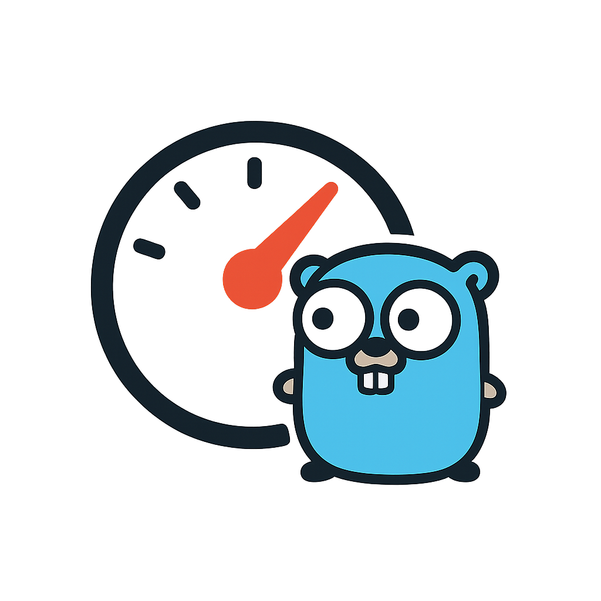

<p align="center">
  
</p>

<p align="center">
  <a href="https://alirizaaynaci.github.io/gorl/"><strong>Read the GoRL documentation →</strong></a>
</p>

<p align="center">
  <a href="https://pkg.go.dev/github.com/AliRizaAynaci/gorl/v2"></a>
  <a href="https://github.com/AliRizaAynaci/gorl/actions/workflows/ci.yml"></a>
  <a href="https://github.com/AliRizaAynaci/gorl/stargazers"></a>
  <a href="https://github.com/AliRizaAynaci/gorl/blob/main/LICENSE"></a>
</p>

# GoRL - High-Performance Rate Limiter Library

GoRL is a high-performance, extensible rate limiter library for Go. It supports multiple algorithms, pluggable storage backends, a metrics collector abstraction, and minimal dependencies for both single-instance deployments and Redis-backed shared-state deployments.

---

## Table of Contents

* [Features](#features)
* [Installation](#installation)
* [Quick Start](#quick-start)
* [Resource-Scoped Limits](#resource-scoped-limits)
* [Docs](#docs)
* [Usage Examples](#usage-examples)
* [Observability](#observability)
* [Benchmarks](#benchmarks)
* [Storage Backends](#storage-backends)
* [Extending GoRL](#extending-gorl)
* [Contributing](#contributing)
* [License](#license)

## Features

* **Algorithms**: Fixed Window, Sliding Window, Token Bucket, Leaky Bucket
* **Storage**: In-memory, Redis, or any custom store (via `Storage` interface)
* **Atomic Redis Execution**: Built-in Redis-backed limiters use Lua-scripted state transitions
* **Fail-Open / Fail-Close**: Configurable policy on backend errors
* **Key Extraction**: Built-in strategies (IP, API key) or custom
* **Resource-Scoped Policies**: Optional per-resource overrides while keeping a shared store and strategy
* **Metrics Collector**: Optional abstraction for counters and histograms, zero-cost when unused
* **Minimal Dependencies**: Zero external requirements for in-memory mode
* **Middleware Support**: Built-in middleware for `net/http`, Fiber, Gin, and Echo

## Installation

```bash
go get github.com/AliRizaAynaci/gorl/v2
```

## Quick Start

```go
import (
  "context"
  "fmt"
  "time"

  "github.com/AliRizaAynaci/gorl/v2"
  "github.com/AliRizaAynaci/gorl/v2/core"
)

func main() {
  limiter, err := gorl.New(core.Config{
    Strategy: core.SlidingWindow,
    Limit:    5,
    Window:   1 * time.Minute,
  })
  if err != nil {
    panic(err)
  }
  defer limiter.Close()

  ctx := context.Background()
  for i := 1; i <= 10; i++ {
    res, _ := limiter.Allow(ctx, "user-123")
    fmt.Printf("Request #%d: allowed=%v, remaining=%d\n", i, res.Allowed, res.Remaining)
  }
}
```

## Resource-Scoped Limits

Existing `v2` usage stays exactly the same. If you want per-resource policies,
you can opt into the additive resource-scoped API:

```go
resourceLimiter, err := gorl.NewResourceLimiter(core.ResourceConfig{
  Strategy: core.SlidingWindow,
  DefaultPolicy: core.ResourcePolicy{
    Limit:  100,
    Window: time.Minute,
  },
  Resources: map[string]core.ResourcePolicy{
    "login": {
      Limit:  5,
      Window: time.Minute,
    },
    "search": {
      Limit:  50,
      Window: time.Second,
    },
  },
})
if err != nil {
  panic(err)
}
defer resourceLimiter.Close()

res, err := resourceLimiter.AllowResource(context.Background(), "login", "user-123")
if err != nil {
  panic(err)
}

fmt.Println(res.Allowed, res.Remaining)
```

Unknown resources use the configured `DefaultPolicy`, so named overrides are
optional rather than required.

### Load Resource Config from JSON or YAML

Example `limits.yaml`:

```yaml
gorl:
  strategy: sliding_window
  redis_url: redis://localhost:6379/0
  fail_open: false
  default:
    limit: 100
    window: 1m
  resources:
    login:
      limit: 5
      window: 1m
    search:
      limit: 50
      window: 1s
```

```go
import (
  "github.com/AliRizaAynaci/gorl/v2"
  "github.com/AliRizaAynaci/gorl/v2/config"
)

cfg, err := config.LoadResourceConfig("limits.yaml")
if err != nil {
  panic(err)
}

resourceLimiter, err := gorl.NewResourceLimiter(cfg)
if err != nil {
  panic(err)
}
defer resourceLimiter.Close()
```

## Docs

The searchable documentation site is the primary guide:

- **[GoRL Documentation](https://alirizaaynaci.github.io/gorl/)**

For offline reading or contributions, the same English Markdown sources remain
available under [docs/README.md](docs/README.md).

Recommended entry points:

- [Getting Started](docs/guides/getting-started.md)
- [Choose an Algorithm](docs/concepts/algorithms.md)
- [Keys and Resources](docs/concepts/keys-and-resources.md)
- [System Overview](docs/architecture/system-overview.md)
- [Concurrency and Lock Sharding](docs/architecture/concurrency.md)
- [Distributed Semantics](docs/architecture/distributed-semantics.md)
- [Middleware Guide](docs/guides/middleware.md)
- [Redis in Production](docs/guides/redis-production.md)
- [Troubleshooting](docs/guides/troubleshooting.md)
- [Public API Reference](docs/reference/public-api.md)

## Usage Examples

### HTTP Middleware (Built-in)

GoRL ships with a ready-to-use `net/http` middleware under `middleware/http`.

**Basic Usage (handler wrapping):**

```go
import (
  "net/http"

  "github.com/AliRizaAynaci/gorl/v2"
  "github.com/AliRizaAynaci/gorl/v2/core"
  mw "github.com/AliRizaAynaci/gorl/v2/middleware/http"
)

limiter, _ := gorl.New(core.Config{
  Strategy: core.SlidingWindow,
  Limit:    10,
  Window:   1 * time.Minute,
})

mux := http.NewServeMux()
mux.Handle("/api/", mw.RateLimit(limiter, mw.Options{
  KeyFunc: mw.KeyByIP(),
}, http.HandlerFunc(func(w http.ResponseWriter, r *http.Request) {
  w.Write([]byte("OK"))
})))

http.ListenAndServe(":8080", mux)
```

**Middleware Chaining:**

```go
rl := mw.NewMiddleware(limiter, mw.Options{
  KeyFunc: mw.KeyByHeader("X-API-Key"),
})

mux.Handle("/api/", rl(myHandler))
```

The middleware always sets `RateLimit-Limit` and `RateLimit-Remaining`, and
adds `RateLimit-Reset` and `Retry-After` when the limiter returns a reliable
duration.

**Available Key Extractors:**
- `mw.KeyByIP()` — client IP (supports `X-Forwarded-For`, `X-Real-Ip`)
- `mw.KeyByHeader("X-API-Key")` — any request header
- `mw.KeyByPath()` — IP + request path (per-endpoint limiting)

### HTTP Middleware (Resource-Scoped)

```go
resourceLimiter, _ := gorl.NewResourceLimiter(core.ResourceConfig{
  Strategy: core.SlidingWindow,
  DefaultPolicy: core.ResourcePolicy{
    Limit:  100,
    Window: time.Minute,
  },
  Resources: map[string]core.ResourcePolicy{
    "/login": {Limit: 5, Window: time.Minute},
    "/search": {Limit: 50, Window: time.Second},
  },
})

mux.Handle("/", mw.RateLimitByResource(resourceLimiter, mw.Options{
  KeyFunc:      mw.KeyByIP(),
  ResourceFunc: mw.ResourceByPath(),
}, http.HandlerFunc(func(w http.ResponseWriter, r *http.Request) {
  w.Write([]byte("OK"))
})))
```

### Fiber

```go
import (
  "github.com/gofiber/fiber/v2"
  "github.com/AliRizaAynaci/gorl/v2"
  "github.com/AliRizaAynaci/gorl/v2/core"
  fibermw "github.com/AliRizaAynaci/gorl/v2/middleware/fiber"
)

limiter, _ := gorl.New(core.Config{
  Strategy: core.FixedWindow, Limit: 100, Window: time.Minute,
})

app := fiber.New()
app.Use(fibermw.RateLimit(limiter)) // key defaults to c.IP()
app.Listen(":3000")
```

### Gin

```go
import (
  "github.com/gin-gonic/gin"
  "github.com/AliRizaAynaci/gorl/v2"
  "github.com/AliRizaAynaci/gorl/v2/core"
  ginmw "github.com/AliRizaAynaci/gorl/v2/middleware/gin"
)

limiter, _ := gorl.New(core.Config{
  Strategy: core.SlidingWindow, Limit: 100, Window: time.Minute,
})

r := gin.Default()
r.Use(ginmw.RateLimit(limiter)) // key defaults to c.ClientIP()
r.Run(":8080")
```

### Echo

```go
import (
  "github.com/labstack/echo/v4"
  "github.com/AliRizaAynaci/gorl/v2"
  "github.com/AliRizaAynaci/gorl/v2/core"
  echomw "github.com/AliRizaAynaci/gorl/v2/middleware/echo"
)

limiter, _ := gorl.New(core.Config{
  Strategy: core.TokenBucket, Limit: 100, Window: time.Minute,
})

e := echo.New()
e.Use(echomw.RateLimit(limiter)) // key defaults to c.RealIP()
e.Start(":8080")
```

> All framework middlewares set `RateLimit-Limit` and `RateLimit-Remaining`,
> and add duration-based headers when reliable timing data is available.
> Pass a custom `Config{KeyFunc: ..., ResourceFunc: ...}` to override the default
> key or resource extraction behavior.

### Docker & Redis Backend

```bash
docker run --name redis-limiter -p 6379:6379 -d redis
```

```go
limiter, err := gorl.New(core.Config{
  Strategy: core.TokenBucket,
  Limit:    100,
  Window:   1 * time.Minute,
  RedisURL: "redis://localhost:6379/0",
})
if err != nil {
  panic(err)
}
```

## Observability

GoRL provides an optional metrics collector abstraction. Below is an example integrating Prometheus:

```go
import (
  "log"
  "net/http"
  "time"

  "github.com/AliRizaAynaci/gorl/v2"
  "github.com/AliRizaAynaci/gorl/v2/core"
  "github.com/AliRizaAynaci/gorl/v2/metrics"
  mw "github.com/AliRizaAynaci/gorl/v2/middleware/http"
  "github.com/prometheus/client_golang/prometheus/promhttp"
)

func main() {
  // Create and register Prometheus collector
  pm := metrics.NewPrometheusCollector("gorl", "sliding_window")
  metrics.RegisterPrometheusCollectors(pm)

  // Initialize limiter with metrics enabled
  limiter, err := gorl.New(core.Config{
    Strategy: core.SlidingWindow,
    Limit:    5,
    Window:   1 * time.Minute,
    RedisURL: "redis://localhost:6379/0",
    Metrics:  pm,
  })
  if err != nil {
    log.Fatal(err)
  }
  defer limiter.Close()

  // Expose Prometheus metrics endpoint
  http.Handle("/metrics", promhttp.Handler())

  // Application handler with rate limiting middleware
  http.Handle("/api", mw.RateLimitFunc(limiter, mw.Options{
    KeyFunc: mw.KeyByHeader("X-API-Key"),
  }, func(w http.ResponseWriter, r *http.Request) {
    w.Write([]byte("OK"))
  }))

  log.Println("Listening on :8080")
  log.Fatal(http.ListenAndServe(":8080", nil))
}
```

## Benchmarks

Every figure is the **median of 10 samples** summarized with `benchstat`, measured
on Apple M4 with Go 1.26.0 against the current release. Redis figures used Redis
7.4.10 in a local `redis:7-alpine` container. `±` is the sample spread.

```bash
GORL_REDIS_URL=redis://127.0.0.1:6379/0 \
go test ./internal/algorithms \
  -run=^$ \
  -bench='^Benchmark(Redis_)?(FixedWindow|SlidingWindow|TokenBucket|LeakyBucket)_' \
  -benchmem \
  -benchtime=1s \
  -count=10 | tee results.txt

benchstat results.txt
```

### Scenarios

| Scenario | What it measures |
| --- | --- |
| Single key | One key, one goroutine, request allowed. |
| Multi key | 1024 distinct keys, one goroutine, request allowed. |
| Denied | Limit already exhausted, so the rejection path runs. |
| Parallel, single key | Every goroutine competes for the same key. |
| Parallel, multi key | Goroutines spread across 1024 distinct keys. |

### In-Memory Backend

Time per operation (ns/op):

| Algorithm | Single key | Multi key | Denied | Parallel, single key | Parallel, multi key |
| --- | ---: | ---: | ---: | ---: | ---: |
| Fixed Window | 209.3 ± 1% | 221.8 ± 0% | 211.2 ± 4% | 204.2 ± 4% | **67.3 ± 4%** |
| Sliding Window | 524.2 ± 13% | 497.9 ± 15% | 399.6 ± 2% | 604.8 ± 2% | **265.8 ± 4%** |
| Token Bucket | 484.3 ± 3% | 548.0 ± 1% | 492.9 ± 1% | 703.5 ± 3% | **367.2 ± 6%** |
| Leaky Bucket | 467.2 ± 2% | 520.8 ± 2% | 456.8 ± 1% | 616.8 ± 8% | **328.1 ± 7%** |

Allocations are constant per algorithm across every scenario: Fixed Window
4 allocs/op (64–72 B/op), Sliding Window 9 allocs/op (168–192 B/op), Token Bucket
and Leaky Bucket 12 allocs/op (272–288 B/op).

The two parallel columns are the interesting pair. `Parallel, single key` is
slower than the sequential case because one key must stay serialized, while
`Parallel, multi key` is the fastest column because unrelated keys hold different
lock shards and run concurrently. See
[Concurrency and lock sharding](docs/architecture/concurrency.md)
for how that works and what it changed.

### Redis Backend

Time per operation (µs/op):

| Algorithm | Single key | Multi key | Denied | Parallel, single key | Parallel, multi key |
| --- | ---: | ---: | ---: | ---: | ---: |
| Fixed Window | 95.2 ± 2% | 95.6 ± 7% | 95.4 ± 6% | 37.5 ± 19% | 44.8 ± 12% |
| Sliding Window | 123.9 ± 11% | 130.5 ± 23% | 124.1 ± 2% | 48.9 ± 7% | 48.3 ± 3% |
| Token Bucket | 118.2 ± 4% | 119.9 ± 4% | 119.6 ± 2% | 49.2 ± 8% | 48.2 ± 5% |
| Leaky Bucket | 118.0 ± 7% | 121.0 ± 4% | 118.8 ± 3% | 47.0 ± 3% | 48.4 ± 3% |

Allocations per operation: Fixed Window 16–17 allocs (456–476 B), Sliding Window
31–32 allocs (~1.03–1.08 KiB), Token Bucket 26–27 allocs (880–916 B), Leaky
Bucket 27 allocs (888–924 B).

Redis numbers are dominated by network round-trip time, not by GoRL. That is why
the parallel columns are roughly twice as fast: concurrent goroutines overlap
their round trips. Compare Redis figures only against each other on the same host
and network path, never against the in-memory table.

These are comparative figures from one machine, not latency guarantees. See
[Benchmarking methodology](docs/contributing/benchmarking.md) for the control
group and A/B comparison rules behind any performance claim in this project.

## Storage Backends

GoRL's storage layer uses a minimal key-value interface.

```go
package storage

import (
  "context"
  "time"
)

type Storage interface {
  // Incr atomically increments the value at key by 1, initializing to 1 if missing or expired.
  Incr(ctx context.Context, key string, ttl time.Duration) (float64, error)

  // Get retrieves the numeric value at key, returning 0 if missing or expired.
  Get(ctx context.Context, key string) (float64, error)

  // Set stores the numeric value at key with the specified TTL.
  Set(ctx context.Context, key string, val float64, ttl time.Duration) error

  // Close releases any resources held by the storage backend.
  Close() error
}
```

### In-Memory Store

Lock-free implementation using `sync.Map` and `sync/atomic`:

```go
store := inmem.NewInMemoryStore()
```

* **Use case**: single-instance and unit tests
* **Expiration**: TTL on each write, background GC cleanup
* **Concurrency**: lock-free via atomic CAS operations

### Redis Store

Scalable store leveraging Redis commands:

```go
store := redis.NewRedisStore("redis://localhost:6379/0")
```

* **Execution**: fixed window uses an atomic counter+TTL script; the other built-in algorithms use algorithm-specific Lua scripts
* **TTL Management**: handled inside the Redis script path
* **Use case**: shared state across services
* **Atomicity**: built-in algorithms use Redis Lua scripts for atomic execution

Current distributed guarantees depend on the selected algorithm.

| Backend + Strategy | Multi-instance status |
| --- | --- |
| In-memory + any strategy | single-process only |
| Redis + Fixed Window | supported atomic shared-state path |
| Redis + Sliding Window | supported atomic shared-state path |
| Redis + Token Bucket | supported atomic shared-state path |
| Redis + Leaky Bucket | supported atomic shared-state path |

See [docs/architecture/distributed-semantics.md](docs/architecture/distributed-semantics.md)
for the current support matrix and planned direction.

## Custom Storage Backend

By default, `gorl.New(cfg core.Config)` wires up:

* **Redis** (if `cfg.RedisURL` is set)
* **In-memory** (otherwise)

To add any other storage backend (JetStream, DynamoDB, etc.) without forking the repo, follow these steps:

1. **Create** a sub-package `github.com/AliRizaAynaci/gorl/v2/storage/yourmodule` and implement the `storage.Storage` interface:

   ```go
   // github.com/AliRizaAynaci/gorl/v2/storage/yourmodule/store.go
   package yourmodule

   import (
     "context"
     "time"
     "github.com/AliRizaAynaci/gorl/v2/storage"
   )

   // YourModuleStore holds your connection fields.
   type YourModuleStore struct {
     // e.g. client, context
   }

   // NewYourModuleStore constructs your store with any parameters.
   func NewYourModuleStore(/* params */) *YourModuleStore {
     return &YourModuleStore{/* initialize fields */}
   }

   func (s *YourModuleStore) Incr(ctx context.Context, key string, ttl time.Duration) (float64, error) {
     // increment logic
   }
   func (s *YourModuleStore) Get(ctx context.Context, key string) (float64, error) {
     // get logic
   }
   func (s *YourModuleStore) Set(ctx context.Context, key string, val float64, ttl time.Duration) error {
     // set logic
   }
   func (s *YourModuleStore) Close() error {
     // cleanup logic
   }
   ```

2. **Extend** `core.Config` in `gorl/core/config.go`:

   ```go
   type Config struct {
     Strategy      StrategyType
     Limit         float64
     Window        time.Duration
     RedisURL      string
     YourModuleURL string // ← new field
     Metrics       Metrics
   }
   ```

3. **Wire** your store in `gorl/limiter.go`:

   ```go
   func New(cfg core.Config) (core.Limiter, error) {
     if cfg.Metrics == nil {
       cfg.Metrics = &core.NoopMetrics{}
     }

     var store storage.Storage
     switch {
     case cfg.YourModuleURL != "":
       store = yourmodule.NewYourModuleStore(cfg.YourModuleURL)
     case cfg.RedisURL != "":
       store = redis.NewRedisStore(cfg.RedisURL)
     default:
       store = inmem.NewInMemoryStore()
     }

     constructor, ok := strategyRegistry[cfg.Strategy]
     if !ok {
       return nil, core.ErrUnknownStrategy
     }
     return constructor(cfg, store), nil
   }
   ```

4. **Use** your custom backend:

   ```go
   import (
     "log"
     "time"
     "github.com/AliRizaAynaci/gorl/v2"
     "github.com/AliRizaAynaci/gorl/v2/core"
   )

   cfg := core.Config{
     Strategy:      core.SlidingWindow,
     Limit:         100,
     Window:        time.Minute,
     YourModuleURL: "your-backend://connection-string",
   }
   limiter, err := gorl.New(cfg)
   if err != nil {
     log.Fatal(err)
   }
   ```

> **Note:** After implementing and wiring up your custom storage backend, open a Pull Request against the `main` branch to merge these changes into the GoRL repository before using it in production.

## Key Selection

GoRL accepts a rate-limit key as the second argument to `Allow(ctx, key)`.

- In direct library usage, your application builds and passes that key.
- In middleware usage, the middleware's `KeyFunc` determines the key.

Example:

```go
key := tenantID + ":" + userID
res, err := limiter.Allow(ctx, key)
```

## Resource Selection

Resource-scoped limiters add a second routing dimension on top of keys:

- `resource` selects which policy should be applied
- `key` selects which identity is counted within that policy

Example:

```go
res, err := resourceLimiter.AllowResource(ctx, "github_api", "tenant:acme")
```


## Contributing

1. Fork the repository
2. Create a branch: `git checkout -b feature/YourFeature`
3. Commit changes: `git commit -m "Add feature"`
4. Push to branch: `git push origin feature/YourFeature`
5. Submit a Pull Request

Please review our [CONTRIBUTING.md](CONTRIBUTING.md) for detailed guidelines.

## License

Distributed under the MIT License. See [LICENSE](LICENSE) for details.
