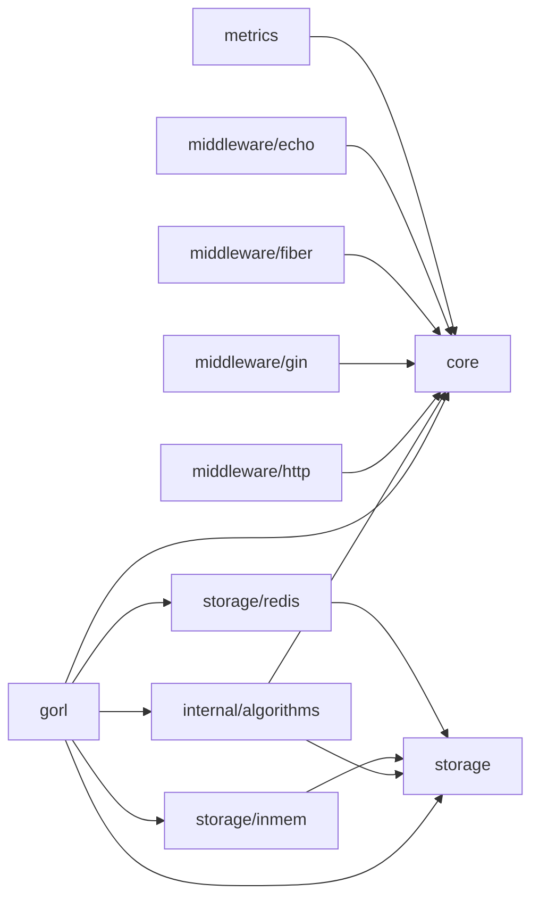

# Package Map

This page is a package-by-package orientation guide for contributors and
maintainers.

## Dependency Boundaries

## Package Responsibilities

### `gorl`

- Exposes the library constructor.
- Selects storage backend and strategy implementation.
- Serves as the main package imported by applications.

### `core`

- Defines stable shared types.
- Contains `Config`, `Limiter`, `Result`, and core errors.
- Defines the metrics interface used by algorithms.

### `internal/algorithms`

- Implements the actual rate-limiting algorithms.
- Contains shared fail-open handling logic.
- Is intentionally not part of the public API contract.

### `storage`

- Defines the minimal state interface all limiters depend on.
- Keeps algorithm logic decoupled from a concrete persistence backend.

### `storage/inmem`

- Provides the default local backend.
- Uses `sync.Map` plus atomic float storage.
- Runs background TTL cleanup.

### `storage/redis`

- Provides the distributed backend selected by `RedisURL`.
- Uses `go-redis/v9`.
- Keeps its public surface intentionally small.

### `middleware/http`

- Provides `net/http` integration helpers.
- Includes request key extractors such as IP, header, and path-based keys.

### `middleware/gin`, `middleware/fiber`, `middleware/echo`

- Wrap the common limiter behavior in framework-native middleware APIs.
- Provide default key extraction suited to each framework.

### `metrics`

- Implements a Prometheus collector adapter.
- Allows algorithms to emit counters and latency observations without taking a
  hard dependency on Prometheus in the core layer.

## Where To Look First

- Library wiring: `limiter.go`
- Public contracts: `core/core.go`
- Algorithm behavior: `internal/algorithms/*.go`
- HTTP integration: `middleware/*`
- External state handling: `storage/*`
