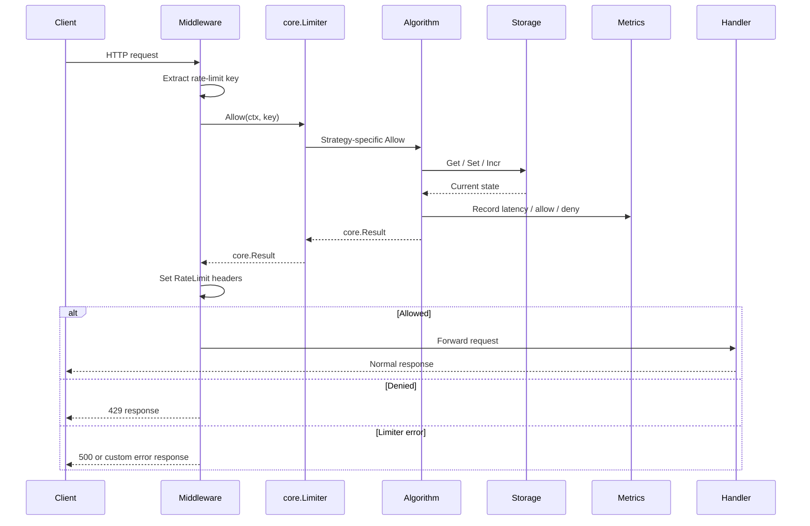

# Request Lifecycle

This page shows the typical execution path for a request that goes through a
GoRL middleware adapter and into a limiter implementation.

## Middleware-to-Limiter Flow

## Step-by-Step Behavior

1. The middleware extracts a key from the incoming request.
2. The middleware calls `Allow(ctx, key)` on the configured limiter.
3. The algorithm reads and updates state through `storage.Storage`.
4. The algorithm builds a `core.Result`.
5. The middleware writes headers from that result.
6. The request is either forwarded, denied, or failed with an internal error.

## Important Implementation Notes

- `middleware/http` requires `Options.KeyFunc`; the framework-specific
  middleware packages provide a default key extractor when one is omitted.
- `FailOpen` and `FailClose` behavior is enforced inside the algorithm layer.
- The in-memory store handles TTL cleanup internally with a background GC loop.
- Redis-backed behavior depends on the storage backend plus the algorithm's
  state transition strategy.
