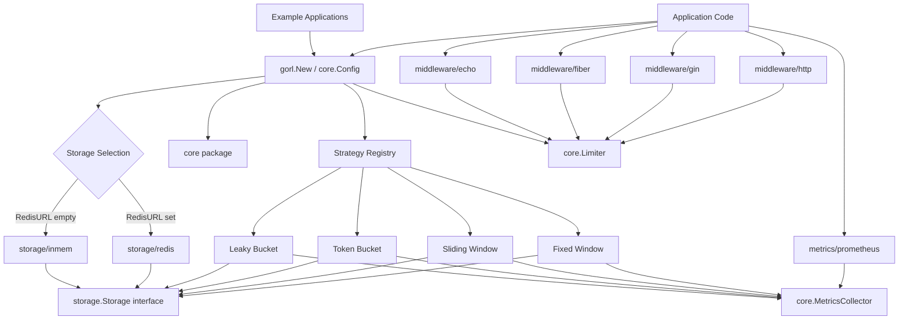

# System Overview

This page describes the current GoRL package architecture as implemented in the
repository today.

## High-Level Architecture

## Package Roles

| Package | Responsibility |
| --- | --- |
| `gorl` | Public constructor entrypoint and strategy/store wiring |
| `core` | Shared types such as `Config`, `Limiter`, `Result`, and metrics interfaces |
| `internal/algorithms` | Algorithm implementations behind the public constructor |
| `storage` | Minimal storage abstraction used by all algorithms |
| `storage/inmem` | Default in-process store |
| `storage/redis` | Redis-backed store selected via `RedisURL` |
| `middleware/*` | Framework adapters for `net/http`, Gin, Fiber, and Echo |
| `metrics` | Prometheus adapter implementing `core.MetricsCollector` |
| `examples/*` | Runnable usage samples for common integration paths |

## Construction Flow

At runtime the library starts from `gorl.New(core.Config)`.

1. `Config.Validate()` runs.
2. `Metrics` defaults to `core.NoopMetrics` when omitted.
3. The constructor chooses a storage backend:
   - `storage/redis` when `RedisURL` is set
   - `storage/inmem` otherwise
4. The constructor looks up the chosen strategy in the internal registry.
5. The selected limiter is returned as a `core.Limiter`.

## Design Characteristics

- The public surface is intentionally small.
- Algorithms depend only on the `storage.Storage` abstraction plus core types.
- Framework middleware is thin and delegates rate decisions to `core.Limiter`.
- Observability is optional and injected through `core.MetricsCollector`.

## Current Caveats

These docs reflect the repository as it exists today.

- `storage/redis` is not a blanket promise of distributed safety. The current
  supported shared-state path is `Redis + FixedWindow`; richer algorithms still
  require stronger atomic state transitions.
- Middleware always emits `RateLimit-*` headers based on `core.Result`, so
  header quality depends on the algorithm's current metadata behavior.

See [Distributed Semantics](./distributed-semantics.md) for the current support
matrix.
