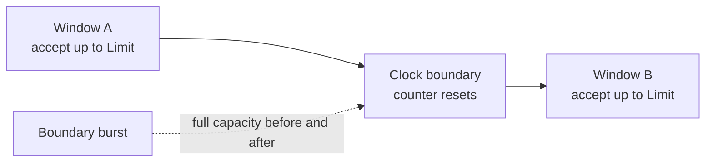
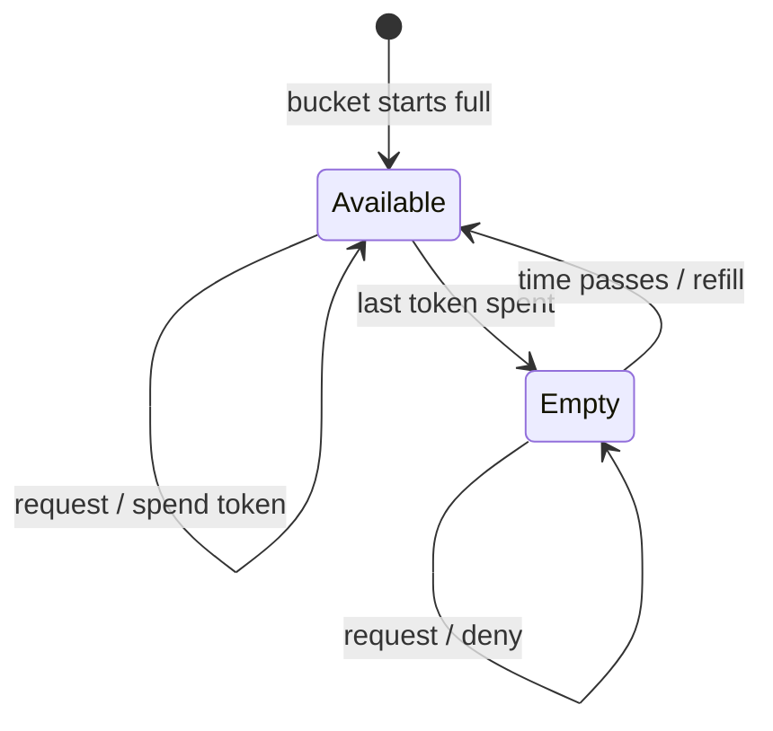

# Choose an algorithm

Choose from the traffic contract, not from the algorithm name. Start with the
simplest behavior that satisfies the product requirement and measure it under
your real key distribution.

## Decision matrix

| Strategy | Admission model | Burst behavior | State shape | Good fit |
| --- | --- | --- | --- | --- |
| Fixed window | Count requests inside a fixed time bucket | Can burst around a boundary | One counter per active bucket | Simple quotas, internal tooling |
| Sliding window | Weight the previous bucket into the current bucket | Smoother than fixed windows | Timestamp plus two counters | Public APIs needing smoother enforcement |
| Token bucket | Spend tokens that refill continuously | Explicit burst capacity up to `Limit` | Tokens plus refill time | Interactive APIs and bursty clients |
| Leaky bucket | Admit while occupancy is below capacity; drain continuously | Applies steady pressure | Occupancy plus leak time | Workloads that should resist sustained spikes |

## Fixed window

Each key is placed into a clock-aligned bucket. Requests are admitted while the
bucket count is at or below `Limit`.



**Choose it when:** implementation simplicity and low state cost matter more
than perfectly smooth traffic.

**Trade-off:** a client can consume one full window just before the boundary and
another just after it.

## Sliding window

GoRL uses an approximate sliding window. It combines the current bucket count
with a time-weighted part of the previous bucket.

```text
estimated usage = previous × (1 - elapsed/window) + current
```

**Choose it when:** you want fewer boundary spikes without storing every request
timestamp.

**Trade-off:** the result is an approximation and needs more state than a fixed
window. The generic non-Redis path serializes the multi-step transition inside
one limiter instance; the bundled Redis path performs it atomically in Lua.

## Token bucket

The bucket begins with `Limit` tokens. One allowed request spends one token.
Tokens return continuously at an effective rate of `Limit / Window`, up to the
configured capacity.



**Choose it when:** short bursts should be accepted while sustained traffic is
bounded.

**Trade-off:** a newly created or fully rested key can immediately spend the
entire bucket.

## Leaky bucket

GoRL tracks an occupancy level that drains continuously. A request is admitted
when the current occupancy is below `Limit`, then increases occupancy by one.

!!! note "Admission meter, not a queue"
    This implementation does not hold or delay requests for later processing.
    It immediately allows or denies them. If you need a work queue, combine
    rate limiting with a separate queueing system.

**Choose it when:** you want steady recovery from a filled capacity and strong
resistance to sustained spikes.

**Trade-off:** callers may interpret the name as automatic request scheduling;
GoRL does not provide that behavior.

## Backend behavior

| Path | Concurrency behavior |
| --- | --- |
| In-memory fixed window | Atomic counter operations in the bundled store |
| Other generic/in-memory strategies | Key-sharded synchronization around multi-step state changes |
| Bundled Redis backend | Algorithm-specific atomic Lua execution |
| Custom `storage.Storage` | The interface operations apply, but bundled Redis script guarantees do not automatically transfer |

Read [Concurrency and lock sharding](../architecture/concurrency.md) for the
same-key correctness model, shard selection, memory trade-off, and measured
parallel behavior.

Read [Distributed semantics](../architecture/distributed-semantics.md) before
using a custom store or shared deployment.
