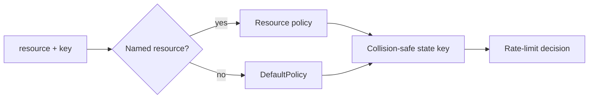

# Keys and resources

Keys answer **who consumes capacity?** Resources answer **which policy applies?**
Keeping those questions separate prevents accidental shared buckets and makes
policy changes easier to reason about.

## Direct limiting

With `core.Limiter`, the application supplies only a key:

```go
result, err := limiter.Allow(ctx, "tenant-a:user-123")
```

Use stable, bounded identifiers. Avoid raw access tokens, unbounded user input,
or secrets because backend keys may be observable to operators.

## Resource-scoped limiting

With `core.ResourceLimiter`, the resource selects a named override and the key
selects the independently counted identity:

```go
result, err := limiter.AllowResource(ctx, "login", "tenant-a:user-123")
```



Unknown resources use `DefaultPolicy`; they are not rejected. The resource name
still participates in the internal state key, so two unknown resources do not
share one bucket when the caller key is equal.

## Recommended key shapes

| Goal | Example key | Notes |
| --- | --- | --- |
| Per authenticated user | `user:42` | Prefer immutable internal IDs |
| Tenant and user | `tenant:acme:user:42` | Prevent cross-tenant collisions |
| API consumer | `client:payments-service` | Map credentials to a non-secret ID first |
| Per IP | `ip:203.0.113.10` | Account for trusted proxies and IPv6 normalization |
| Global budget | `global` | Every call intentionally shares one bucket |

## Middleware defaults

- `middleware/http` requires an explicit `KeyFunc`.
- Gin defaults to `ClientIP()`.
- Fiber defaults to `IP()`.
- Echo defaults to `RealIP()`.
- Resource-aware Gin and Echo prefer the matched route pattern; Fiber and the
  standard HTTP helper default to the request path.

## Proxy trust

The standard HTTP `KeyByIP()` checks `X-Forwarded-For`, then `X-Real-Ip`, then
`RemoteAddr`. It does not validate whether the immediate peer is a trusted
proxy. Strip or overwrite forwarding headers at the network edge before relying
on this helper for an adversarial public endpoint.

## Empty and high-cardinality keys

GoRL does not reject an empty request key. For example, `KeyByHeader` returns an
empty string when the header is absent, which makes all such requests share one
bucket. Validate required identity before rate limiting or return an explicit
authentication error.

Attackers can also generate many distinct keys and grow backend state until TTL
cleanup. Normalize and bound the identity space at the application boundary.
