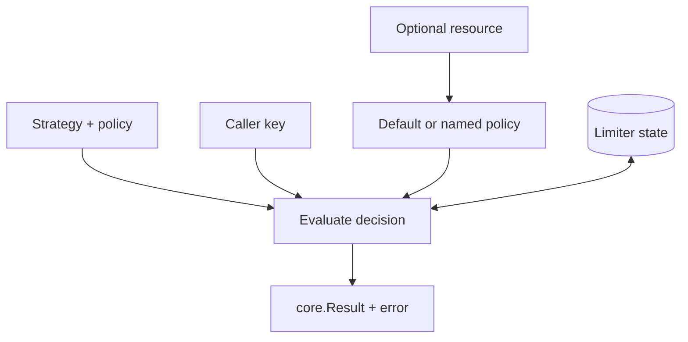

# Rate limiting model

GoRL evaluates one identity against one policy and returns a decision with
metadata. It does not authenticate users, discover tenants, or choose an HTTP
route on the application's behalf.

## The four inputs

Every decision is determined by four ideas:

| Input | Meaning | Owned by |
| --- | --- | --- |
| Strategy | How capacity changes over time | Configuration |
| Policy | Capacity (`Limit`) and time span (`Window`) | Configuration |
| Key | Identity whose traffic is counted | Application or middleware |
| State | Previous decisions for that identity | In-memory or Redis backend |

Resource-scoped limiting adds a resource selector before the policy is chosen.

## Capacity is per key

A configuration of 100 requests per minute does not mean 100 requests for the
whole process unless every request uses the same key. Each distinct key creates
an independent state namespace inside the limiter.

That makes key design part of the policy:

- `user-123` enforces per-user capacity,
- `tenant-a:user-123` isolates equal user IDs across tenants,
- `tenant-a` enforces a tenant-wide budget,
- a constant such as `global` creates one shared application budget.

## Time metadata is prospective

`Reset` answers when the limiter would fully reset or refill if no more requests
arrive. `RetryAfter` answers when a currently denied request can reliably be
tried again. They are durations calculated at decision time, not absolute wall
clock timestamps.

## Storage changes scope, not policy

The same `Strategy`, `Limit`, and `Window` can use either backend:

- in-memory state is shared by goroutines using one limiter instance,
- Redis state is shared by application instances using the same Redis database
  and key namespace.

The backend changes the consistency and operational shape of the limit, but it
does not change the configured capacity.

## Lifecycle

Construct a limiter once, reuse it for requests, and call `Close` once during
shutdown. Creating a limiter per request resets or fragments state and creates
unnecessary backend connections and background work.
