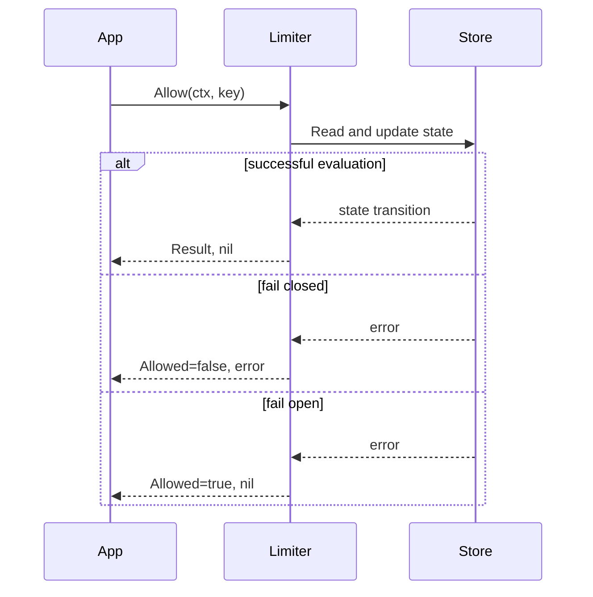

# Results and HTTP headers

Every limiter decision returns `core.Result` plus an error. Treat the error as
the execution status and `Allowed` as the policy decision.

## `core.Result`

| Field | Meaning |
| --- | --- |
| `Allowed` | The current request may proceed |
| `Limit` | Configured whole-request capacity |
| `Remaining` | Whole-request capacity remaining after this decision |
| `Reset` | Duration until full reset or refill if no more requests arrive |
| `RetryAfter` | Earliest reliable retry delay for a denied request |

`Reset` and `RetryAfter` are relative `time.Duration` values. A zero duration
means that no positive, reliable duration was returned; it does not necessarily
mean “retry immediately.”

## Decision flow

## Middleware header mapping

The bundled adapters use the same mapping:

| Header | Source | Emitted when | Wire value |
| --- | --- | --- | --- |
| `RateLimit-Limit` | `Result.Limit` | Successful limiter call | Decimal integer |
| `RateLimit-Remaining` | `Result.Remaining` | Successful limiter call | Decimal integer |
| `RateLimit-Reset` | `Result.Reset` | Duration is positive | Ceiling of seconds |
| `Retry-After` | `Result.RetryAfter` | Request is denied and duration is positive | Ceiling of seconds |

`RateLimit-Reset` is emitted as a relative number of seconds by the current
implementation, not as a Unix timestamp. `Retry-After` uses the HTTP delta-
seconds form.

Allowed requests continue to the application handler. Denied requests receive
HTTP `429 Too Many Requests` by default. Fail-closed backend errors receive HTTP
500 by default and do not receive rate-limit headers because middleware handles
the error before mapping a result.

## Failure-policy nuance

On a runtime backend error with `FailOpen: true`, GoRL returns an allowed result
with the configured `Limit`, zero `Remaining`, and zero timing fields. Bundled
middleware therefore emits `RateLimit-Limit` and `RateLimit-Remaining: 0` while
allowing the request. Do not interpret remaining capacity during a fail-open
event as authoritative.

## Custom responses

Use the middleware-specific denied and error handlers when your API needs a
stable error schema, trace ID, localized message, or additional logging. Keep
the limiter metadata as the source of truth instead of recomputing retry times
in the handler.
