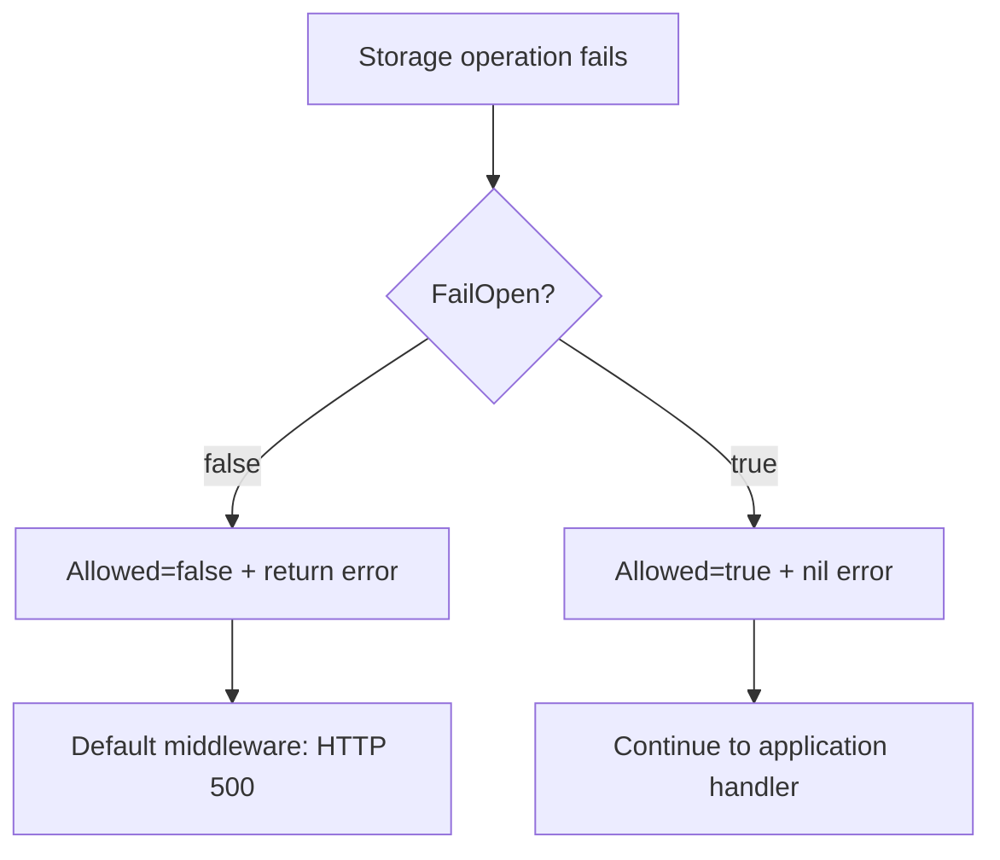

# Failure policy

`FailOpen` controls runtime storage errors. It does not make every constructor or
configuration failure recoverable.

## Choose deliberately

| Policy | Backend error result | Appropriate when | Main risk |
| --- | --- | --- | --- |
| Fail closed (`false`) | Deny and return the error | Abuse prevention or cost protection is mandatory | A backend incident can reject legitimate traffic |
| Fail open (`true`) | Allow with no returned error | Availability is more important than enforcement | A backend incident temporarily removes protection |

## Constructor failures happen first

When `RedisURL` is configured, construction parses the URL, creates a client,
and performs a ping with a two-second timeout. An invalid URL or failed startup
ping makes `gorl.New` or `gorl.NewResourceLimiter` return an error even when
`FailOpen` is true.

This behavior is useful for detecting a broken deployment, but it means fail-
open does not allow an application to start without its configured Redis
backend. If startup without Redis is a requirement, the application must define
its own explicit fallback construction path and understand that in-memory state
will not be shared.

## Runtime semantics

At runtime, bundled algorithms centralize backend-error handling:

- fail closed returns `Allowed: false`, the configured limit, and the error;
- fail open records an allow metric and latency, then returns `Allowed: true`
  with no error;
- fail-open `Remaining`, `Reset`, and `RetryAfter` values are zero and should not
  be used for capacity planning.

## Operational checklist

- Alert on Redis health independently; GoRL's bundled Prometheus collector does
  not expose backend-error counters.
- Log limiter errors in custom middleware error handlers before returning.
- Exercise the chosen policy in a staging failure test.
- Set upstream timeouts so a slow backend cannot consume the entire request
  latency budget.
- Document whether an allowed request during fail-open may trigger expensive or
  irreversible work.

## Hybrid fallback warning

Switching from Redis to a new in-memory limiter during an incident creates a
fresh, per-process budget. That may be acceptable as a deliberately looser
emergency mode, but it is not equivalent to continuing the shared Redis policy.
