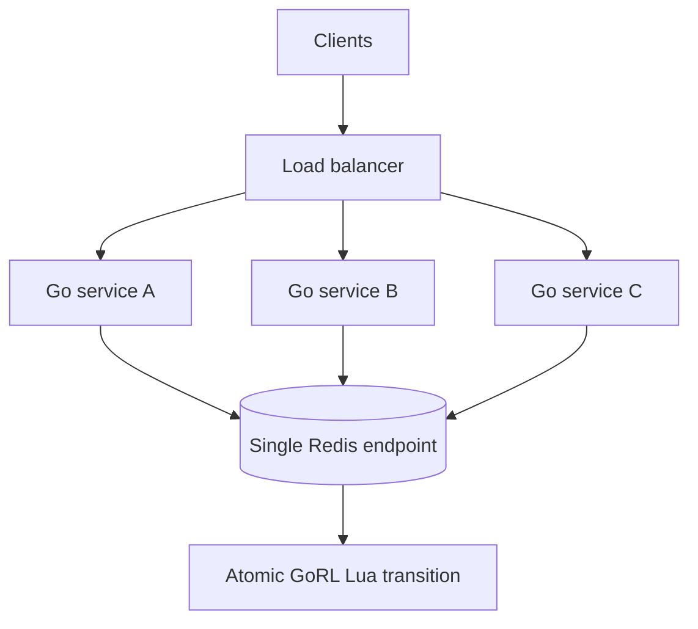

# Redis in production

Use Redis when multiple application processes must enforce one shared policy.
The bundled backend executes each built-in algorithm decision atomically with a
Lua script.

## Topology



Every instance must use the same Redis deployment, database, policy values, and
logical key scheme for the limit to be shared consistently.

## What is atomic

- Fixed window increments its counter and applies TTL in one script.
- Sliding window updates its timestamp, current count, and previous count in one
  script.
- Token bucket refills and consumes in one script.
- Leaky bucket drains and admits in one script.

Multi-key strategies use Redis hash-tagged keys so their related state names
share one hash slot. However, the bundled constructor currently creates a
single-node `go-redis` client from one URL; it does not construct a Redis Cluster
client. Hash tags should not be read as a public Redis Cluster support promise.

## Connection behavior

Setting `RedisURL` selects Redis:

```go
limiter, err := gorl.New(core.Config{
    Strategy: core.TokenBucket,
    Limit:    100,
    Window:   time.Minute,
    RedisURL: "redis://localhost:6379/0",
})
```

Construction validates the URL and performs a ping with a two-second context
timeout. The client is closed when the limiter is closed.

## Capacity and latency planning

Each decision makes a Redis round trip. Measure:

- p50, p95, and p99 limiter latency from the application region,
- Redis CPU and command latency while Lua scripts run,
- active key cardinality and memory over at least one TTL horizon,
- reconnect behavior during failover,
- application behavior under the selected [failure policy](failure-policy.md).

Avoid putting Redis across a high-latency network boundary. Rate limiting sits
on the request path, so backend latency is added directly to application
latency.

## Key cardinality and expiration

State is namespaced by strategy and caller key. Sliding, token, and leaky
strategies maintain multiple keys per active identity. TTLs eventually remove
idle state, but an attacker can still create a high short-term cardinality.

- Authenticate or normalize identifiers before constructing keys.
- Bound arbitrary client-supplied dimensions.
- Monitor Redis memory and evictions.
- Do not use `allkeys-lru` eviction as a substitute for policy design; evicting
  limiter state effectively resets capacity for that key.

## Deployment changes

Keep policy values consistent across a rolling deployment. Two application
versions using the same state keys with different `Limit` or `Window` values can
produce confusing metadata and enforcement during the overlap.

For algorithm changes, use a controlled rollout. Strategy-specific prefixes
separate state, so moving strategies starts a new logical budget rather than
converting existing state.

## Production checklist

- Place the application and Redis close enough for the required latency budget.
- Protect Redis credentials and prefer encrypted transport where your deployment
  requires it.
- Set an explicit fail-open/fail-closed policy.
- Monitor availability, latency, memory, evictions, and script errors.
- Load test with realistic key cardinality, not a single hot key only.
- Call `Close` during graceful application shutdown.
- Verify recovery behavior after Redis restart or failover.
