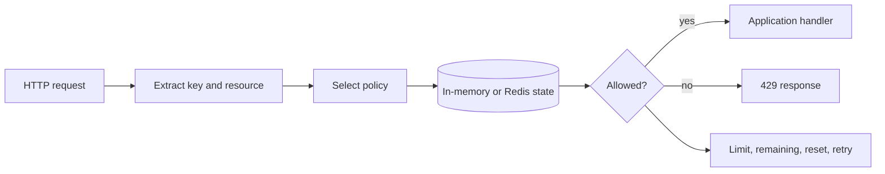

---
hide:
  - navigation
  - toc
---

<section class="gorl-hero">
  <div class="gorl-hero__copy">
    <p class="gorl-kicker">Rate-limit control for Go services</p>
    <h1>Keep traffic inside the lines.</h1>
    <p class="gorl-hero__lede">
      Four algorithms, in-memory or Redis state, resource-level policies, HTTP middleware,
      and Prometheus metrics behind one small Go API.
    </p>
    <div class="gorl-actions">
      <a class="md-button md-button--primary" href="guides/quickstart/">Start in 60 seconds</a>
      <a class="md-button" href="concepts/algorithms/">Choose an algorithm</a>
    </div>
  </div>
  <div class="gorl-trace" aria-label="Example rate-limit request trace">
    <div class="gorl-trace__head">
      <span>request trace / 0042</span>
      <span class="gorl-trace__pulse" aria-hidden="true"></span>
    </div>
    <div class="gorl-trace__row"><span class="gorl-trace__label">resource</span><span class="gorl-trace__value">login</span></div>
    <div class="gorl-trace__row"><span class="gorl-trace__label">key</span><span class="gorl-trace__value">tenant-a:user-123</span></div>
    <div class="gorl-trace__row"><span class="gorl-trace__label">policy</span><span class="gorl-trace__value">5 req / 1m · sliding</span></div>
    <div class="gorl-trace__row"><span class="gorl-trace__label">backend</span><span class="gorl-trace__value">redis · atomic lua</span></div>
    <div class="gorl-trace__row"><span class="gorl-trace__label">decision</span><span class="gorl-trace__value gorl-trace__value--deny">DENY · retry 12s</span></div>
  </div>
</section>

<div class="gorl-strip">
  <div class="gorl-strip__item"><span class="gorl-strip__value">4 algorithms</span><span class="gorl-strip__label">fixed, sliding, token, leaky</span></div>
  <div class="gorl-strip__item"><span class="gorl-strip__value">2 backends</span><span class="gorl-strip__label">in-memory and Redis</span></div>
  <div class="gorl-strip__item"><span class="gorl-strip__value">4 adapters</span><span class="gorl-strip__label">HTTP, Gin, Fiber, Echo</span></div>
  <div class="gorl-strip__item"><span class="gorl-strip__value">1 decision</span><span class="gorl-strip__label">allow or deny with metadata</span></div>
</div>

## Install

```bash
go get github.com/AliRizaAynaci/gorl/v2
```

Create a limiter, give each caller a stable key, and close the limiter when the
application shuts down:

```go
limiter, err := gorl.New(core.Config{
    Strategy: core.SlidingWindow,
    Limit:    100,
    Window:   time.Minute,
})
if err != nil {
    log.Fatal(err)
}
defer limiter.Close()

result, err := limiter.Allow(ctx, "tenant-a:user-123")
```

[Run the complete quickstart](guides/quickstart.md){ .md-button .md-button--primary }

## Pick the policy shape

| Strategy | Traffic shape | Primary strength | Watch for |
| --- | --- | --- | --- |
| Fixed window | Hard count per clock bucket | Lowest conceptual and state cost | Boundary bursts |
| Sliding window | Weighted current and previous buckets | Smoother enforcement | Approximation and more state |
| Token bucket | Capacity refills continuously | Controlled bursts | Starts with a full bucket |
| Leaky bucket | Occupancy drains continuously | Steady admission pressure | It meters; it does not queue work |

All four algorithms support both bundled backends. The built-in Redis paths use
Lua scripts for atomic state transitions across application instances.

[Compare algorithms in depth](concepts/algorithms.md)

## Follow a request



The application owns identity and resource selection. GoRL owns policy
evaluation, state transitions, result metadata, and optional metrics.

## Go deeper

<div class="gorl-grid">
  <a class="gorl-card" href="concepts/keys-and-resources/">
    <span class="gorl-card__eyebrow">Model</span>
    <strong>Keys and resources</strong>
    <p>Design tenant-safe identities and attach different policies to named operations.</p>
  </a>
  <a class="gorl-card" href="guides/redis-production/">
    <span class="gorl-card__eyebrow">Production</span>
    <strong>Operate with Redis</strong>
    <p>Understand atomicity, latency budgets, cluster key placement, and failure policy.</p>
  </a>
  <a class="gorl-card" href="guides/middleware/">
    <span class="gorl-card__eyebrow">Integration</span>
    <strong>Protect HTTP endpoints</strong>
    <p>Use net/http, Gin, Fiber, or Echo and return useful rate-limit metadata.</p>
  </a>
  <a class="gorl-card" href="guides/troubleshooting/">
    <span class="gorl-card__eyebrow">Operations</span>
    <strong>Diagnose unexpected decisions</strong>
    <p>Work through shared buckets, proxy headers, Redis startup, and registration errors.</p>
  </a>
</div>

## API lookup

Use the [curated public API reference](reference/public-api.md) for contracts and
semantics, then switch to
[pkg.go.dev](https://pkg.go.dev/github.com/AliRizaAynaci/gorl/v2) for package
indexes and exact exported declarations.
